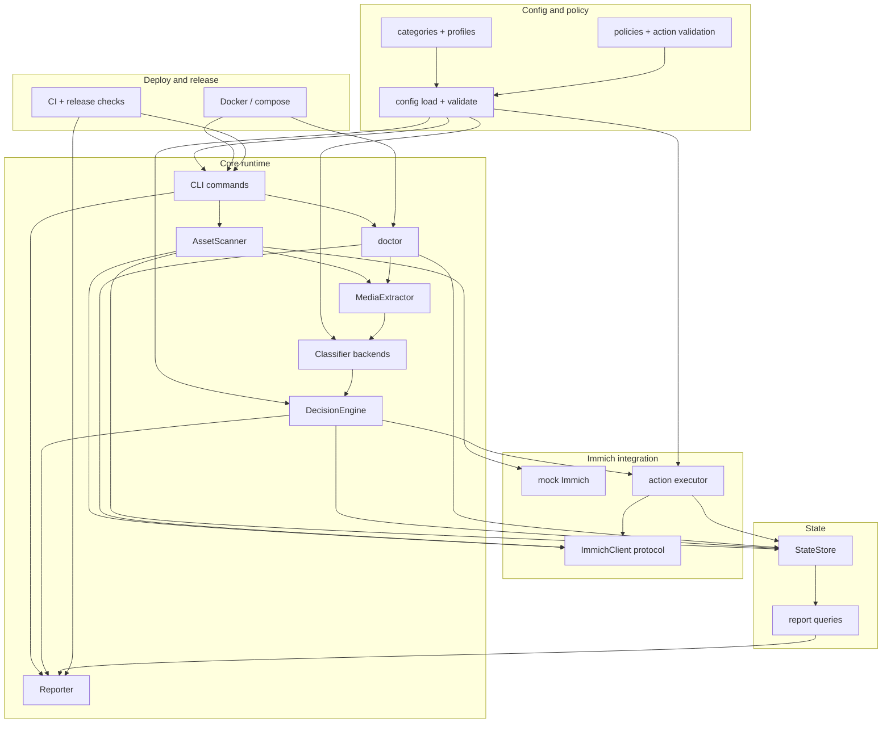

# Dependency map

## Mermaid dependency graph



## Parallelization notes

- **Config schema** blocks classifier mapping, decision policy, preset validation, and action validation.
- **Mock Immich** blocks scanner end-to-end tests but not config/state/classifier unit work.
- **State** blocks idempotency, reprocess decisions, action audit, and historical reports.
- **Decision/reporting** blocks useful dry-run UX and the live action executor.
- **Extractor** blocks real classifier inputs and video support.
- **Doctor/Docker** depend on CLI command names, runtime paths, and optional dependency checks.

## Module dependency table

| Module / package | Depends on | Provides to |
|------------------|------------|-------------|
| `config` | none | all modules |
| `cli` | `config` | user commands and orchestration |
| `immich_client` | `config` | `scanner`, `actions`, `doctor` |
| `scanner` | `config`, `immich_client`, `state` | extraction/classification pipeline |
| `state` | `config` | scanner idempotency, decisions, actions, reports |
| `extractor` | `config`, `immich_client` bytes | classifier |
| `classifier` | `config`, extractor inputs | decision engine |
| `decision` | `config`, classifier outputs | action executor, state, reporter |
| `actions` | `config`, `immich_client`, decision plans | state audit |
| `reporter` | `state`, decision/run summaries | stdout/files |
| `doctor` | `config`, `immich_client`, state/temp paths, optional model/ffmpeg | operator readiness |
| `docker` | CLI entrypoint, runtime paths | deployment |

## Blocking dependencies by sprint

1. **Sprint 002** locks config/policy shape and unblocks classifier, decision, presets, and action validation.
2. **Sprint 003** provides mock Immich and scanner read path for end-to-end dry-run tests.
3. **Sprint 004** provides state APIs for idempotency, reports, and reprocess foundations.
4. **Sprint 005** provides classifier outputs that decision logic can consume.
5. **Sprint 006** provides action plans and dry-run reporting, unblocking safe live action execution.
6. **Sprint 007** provides guarded Immich mutations and action audit.
7. **Sprint 008** provides image media inputs for real classifier backends.
8. **Sprint 009** extends extractor/classifier flow to video.
9. **Sprint 010** packages safe runtime and operator readiness checks.
10. **Sprint 011** builds state-backed reports and observability.
11. **Sprint 012** hardens release readiness and closes documentation/security gaps.

## v2 service-mode addendum (per ADR-0010)

The v2 release adds a service layer that consumes the existing pipeline modules as a library; it does not rewrite them.

```mermaid
flowchart TB
  subgraph svc [v2 service layer]
    API[FastAPI app /api/v1]
    AUTH[auth: Immich proxy login]
    SEC[security: encryption, CSRF, rate limit]
    SCH[scheduler: APScheduler in-proc]
    AUD[audit log writer]
    MOD[model lifecycle: catalog, download, verify]
    WEB[frontend: React/Vite, served as static]
  end

  subgraph existing [Existing pipeline (reused unchanged)]
    SCAN[AssetScanner]
    EXT[MediaExtractor]
    CLF[Classifier backends]
    DEC[DecisionEngine]
    ACT[Action executor]
    ST[StateStore v2: multi-tenant]
    REP[Reporter]
  end

  WEB --> API
  API --> AUTH
  API --> SEC
  API --> SCH
  API --> AUD
  API --> MOD
  AUTH --> IMM[Immich /auth/login]
  SCH --> SCAN
  ACT --> AUD
  MOD --> CLF
  ST --> AUD
```

| New module | Depends on | Provides to |
|------------|------------|-------------|
| `service.app` (FastAPI) | `service.security`, `service.auth`, existing pipeline | HTTP API surface |
| `service.auth` | `immich_client` (proxy login), `state` (sessions table) | request-scoped user identity |
| `service.security` | env (`MR_MASTER_KEY`) | token encryption, CSRF, rate limit, cookie helpers |
| `service.scheduler` | APScheduler, `state`, `scanner` | per-user scheduled scans, concurrency cap |
| `service.audit` | `state` (audit_log table) | structured audit entries; consumed by API and dashboard |
| `service.models` | catalog JSON, network, `state` (model_registry) | first-run model install, switch, uninstall |
| `frontend/` (Vite) | OpenAPI from `service.app` | static dashboard assets shipped in the wheel |

**v2 cross-cutting changes:**
- `state` schema gains `user_id` on every existing table; new tables `users`, `sessions`, `audit_log`, `model_registry`, `user_api_keys`. Fresh `state-v2.db`; no in-place migration from v1.
- `immich_client` gains `auth_login`, `users_me`, `list_users`, locked-folder visibility writes, optional webhook signature verifier.
- `actions` gains `move_to_locked_folder`; `archive` is either implemented or removed from the public action vocabulary.
- `config` splits: service-level YAML (Immich URL, master key path, port) stays in YAML; per-user category/policy config moves to the DB.

## Phase D additions

| New module | Depends on | Provides to |
|------------|------------|-------------|
| `service.runner` | existing pipeline (`scanner`, `extractor`, `classifier`, `decision`, `actions`), `state_v2`, `service.scheduler` | real-pipeline runner + `submit_real_scan` (Phase D PR 1) |
| `service.classifier_cache` | `model_catalog`, `onnx_backend`, `classifier` | per-process `ConfiguredClassifier` cache keyed on active model sha (Phase D PR 2) |
| `service.locked_folder` | `httpx`, `auth.decrypt_session_token` | PIN-unlock + per-asset revert flow used by `POST /me/locked-folder/unlock` (Phase D PR 4) |

The Phase D action vocabulary added `move_to_locked_folder` to `ALLOWED_ACTIONS` / `SIDE_EFFECT_ACTIONS`, capability-gated via `ImmichCapabilities.locked_folder`. `archive` is now deprecated in favour of `move_to_locked_folder`; configs that name it emit a `DeprecationWarning` at validation time.

## Phase E additions

The dashboard frontend lives in a sibling subgraph that the Python
package consumes only as a built static bundle.

| New module / dir | Depends on | Provides to |
|------------------|------------|-------------|
| `frontend/` (Vite + React + TS + Tailwind + Headless UI + TanStack Query) | npm registry, the v2 OpenAPI surface from `service.app` | The dashboard SPA — `npm run build` emits a static bundle into `src/mediarefinery/web/` |
| `service.web` | `starlette.staticfiles`, `starlette.middleware.base`, `service.app`, `service.config` | `mount_web()` attaches a strict-CSP / security-headers middleware to every response and serves the frontend bundle at `/` when present; honors `MR_WEB_ROOT` for tests and operator overrides |

**v2 Phase E cross-cutting notes:**
- The frontend never reaches third-party origins. CSP locks `default-src 'self'`; `style-src` allows `'unsafe-inline'` for Headless UI / inline `style` props only — `script-src` stays `'self'`. Threat-model T01 / T11 verified by `tests/service/test_web_static.py`.
- The dashboard bundle is regenerated on every build and is gitignored at `src/mediarefinery/web/`. The wheel still ships the pre-built bundle (Phase F bakes it during the Docker frontend stage; CI also runs `npm run build` before pytest so backend PRs cannot silently break the static-mount integration).
- The PIN-unlock UI (Phase E PR 4) drives the existing `POST /api/v1/me/locked-folder/unlock` (added in Phase D PR 4); no new backend endpoint required for that flow.
- **Backend gap surfaced for PR 6:** `DELETE /api/v1/me` (account purge, threat-model T20) is not yet implemented in `service.routers`. The Settings page that drives data-purge will need a backend PR before its frontend can land.

## Contract notes

- **2026-05-01 (v2 Phase D):** Locked Folder forward + reverse paths are wired. Forward writes (`PUT /assets/{id} {visibility:"locked"}`) use the user's `x-api-key`. Reverse writes (`visibility:"timeline"`) require a Bearer session that has been PIN-unlocked via `POST /api/auth/session/unlock`; the PIN flows through MR to Immich and is never logged, audited, or persisted, and the PIN-unlocked Bearer survives only inside the request handler (rebound to `None` in `finally`, never written to `state-v2.db`). The asymmetry is the load-bearing privacy guarantee for T09/T10. The `/scans` POST handler auto-flips between `submit_scan` (synthetic, no model installed) and `submit_real_scan` (real pipeline) based on `model_registry.active`.
- **2026-04-30 (v2 Phase A):** [ADR-0010](../docs/adr/ADR-0010-v2-service-architecture.md) supersedes ADR-0009 and establishes v2 service mode as the public release target. The v2 service-mode addendum above documents the new module dependencies that did not exist under the CLI-only architecture. Existing pipeline modules in the original graph are reused unchanged. ADR-0009's CLI-tag goal is retired.
- **2026-04-25 (Sprint 000.5):** Example config, [docs/07-config-spec.md](../docs/07-config-spec.md), and [templates/docker-compose.example.yml](../templates/docker-compose.example.yml) were aligned (category-first `policies`, optional informational `preset`, `/data/...` paths with compose volumes, secrets via `.env`). The `config` → consumers dependency above is unchanged; validate against updated templates when implementing `mediarefinery config validate`.
- Public behavior and config schema belong in `docs/` and ADRs, not only in code comments.
- The product is universal: category ids are user-defined strings, and sensitive/NSFW names belong only to preset examples.
- `delete` and `trash` are not supported product actions; see [../docs/adr/ADR-0005-no-auto-delete.md](../docs/adr/ADR-0005-no-auto-delete.md).
